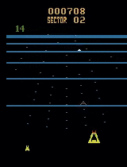
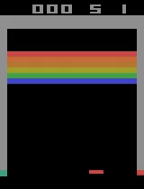

DERL is a a deep reinforcement learning package with a focus on
simplicity. It is built on top of PyTorch.

<p align="middle">
  
  
  
  <br/>
  
  
  <p align="center">
    <sub><i>Parts of episodes where policies were learned with PPO.</i></sub>
  </p>
</p>

Currently implemented algorithms:

- A2C
- PPO
- DQN (n-step, double, dueling, with prioritized experience replay,
with noisy networks for exploration)

## Installation

The installation script will install torch but it might be better it
install it manually beforehand in order to insure proper system and
CUDA dependencies.

```{bash}
git clone https://github.com/MichaelKonobeev/derl.git
pip install -e derl
```

`gym[atari]` and `pybullet` will be installed by `setup.py`, but you will need
to install other environment requirements such as mujoco manually.

Now you can run training:

```{bash}
derl ppo --env-id BreakoutNoFrameskip-v4 --logdir logdir/breakout.00
```
or 3-step double DQN with prioritized experience replay and
dueling architecture:

```{bash}
derl dqn --env-id BreakoutNoFrameskip-v4 --logdir logdir/breakout.00
```

Or if `gym[mujoco]` is installed:

```{bash}
derl ppo --env-id HalfCheetah-v3 --logdir logdir/half-cheetah.00
```

Different learning algorithms are selected by passing positional
argument to derl script, for a full list of arguments you can use `derl -h`,
to see arguments of a particular algorithm (call it `alg`) use `derl alg`.

The script automatically selects different hyperparameters for
atari and mujoco envs.


# Overview

The package defines four essential components:

1. `Policy` takes a `torch.nn.Module` during construction and upon
calling `act` method returns a dictionary of predictions made with
that policy. This method could be called in two modes: one to collect
rollouts and another useful for training, for example when we want
to give *Q*-value predictions for all actions in order to perform
training. Switching between the modes is done by passing a boolean
to `training` keyword argument.

2. `EnvRunner` takes a `Policy` and an `env` during construction and
collects rollouts. `EnvRunner`'s count the number of steps performed
during agent-environment interaction which is useful for several
reasons including annealing variables (such as learning rate and
exploration epsilon) and writing summaries.  Performing composition
with `EnvRunner`'s could easily be done using `EnvRunnerWrapper`.
Additionally, one could apply transformations to a rollout, for
example in  the package this is used to computed Generalized Advantage
Estimators for PPO.  Experience replay is also implemented as an
`EnvRunner` which simplifies the interface when working with learning
algorithms.

3. `Alg` uses `EnvRunner` to collect rollouts and perform updates.  In
the current implementation algorithms wrap `AlgLoss` class which
in turn defines algorithm loss functions (they tend to be rather
complicated in RL which is why using a separate class for them makes
a lot of sense), but of course there is no requirement to do so
thanks to duck typing. All of the currently implemented algorithms
write nice summaries of their training to tensorboard.

4. `Factory` constructs first `EnvRunner`, then `Alg` instances.  It
simplifies working with large number of keyword arguments as much
as possible. In particular it by default ensures that all keyword
arguments passed to it during construction were used during algorithm
instantiation.

In addition, there are several smaller things that greatly simplify
working on an RL project with typical benchmarks: it is easy to
create appropriately wrapped env instance just by calling `derl.env.make`
and it is easy to create a `torch.nn.Module` for mujoco or atari
environments using `make_model` function.
